# 账单解析与判断规则

> 本页按现行代码重新梳理“文件进入系统后，如何从原始账单变成可入账经济事件”的完整判断链。它是新增来源、修复误判和验收真实账单时的统一依据。上传、批次和证据存储见[账单上传与解析](./账单上传与解析.md)，整理、人工处理和入账见[账单整理与入账](./账单整理与入账.md)。产品口径以《个人财务业务规则与验收》为准，代码和自动测试是已落地行为的最终证据。

## 1. 先记住四个结论

1. **解析、经济性质、账户关系、跨账单合并是四层不同判断。** 文件能读出来，不代表已经知道它是消费、收入、退款或本人转账；知道是转账，也不代表两端账户已经映射。
2. **来源专用事实优先，通用规则只做兜底。** 支付宝、微信成熟的字段与动作规则直接复用；银行表格复用通用推断，不按银行复制整套解析器，只有稳定差异做声明式 profile。
3. **同一事件可以有多条原始证据，但一条原始记录也可以独立成一个事件。** “1 条原始记录”说明当前只找到了一个来源证据，不代表系统漏存；只有另一份账单中存在满足强条件的对应行，才能合并成“2 条原始记录”。
4. **自动化只处理能证明的事实。** 金额相同、时间接近、商户相似只能形成候选，不能冒充来源身份；账户、退款原交易或同一事件存在多候选时必须由用户决定。

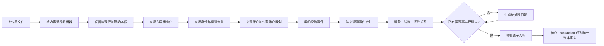

| 层级 | 只负责什么 | 明确不负责什么 | 典型输出 |
| --- | --- | --- | --- |
| 文件层 | 防重、保存原文件、选择解析器 | 不创建交易，不猜账户 | `pf_import_file`、解析器描述 |
| 解析层 | 读取物理行、映射原始列、标准化时间金额状态 | 不查询用户账户，不跨文件匹配 | `EvidenceDocument`、原始行 |
| 身份层 | 判断是否再次观察到同一来源记录 | 不按金额和时间把独立交易合并 | source identity、core digest |
| 账户层 | 把来源账户、付款方式别名映射到正式账户 | 不改变来源身份，不创建经济事件 | 账户映射或忽略事实 |
| 整理层 | 合并证据、判断事件性质与关系、生成问题 | 不直接绕过门禁写正式账本 | event、relation、review issue |
| 入账层 | 校验整批可入账性并写核心账本 | 不修补解析结果，不部分入账 | `Transaction` 与证据链接 |

## 2. 全局判断优先级

任何来源都遵循下列优先级；低优先级事实不得覆盖高优先级事实。

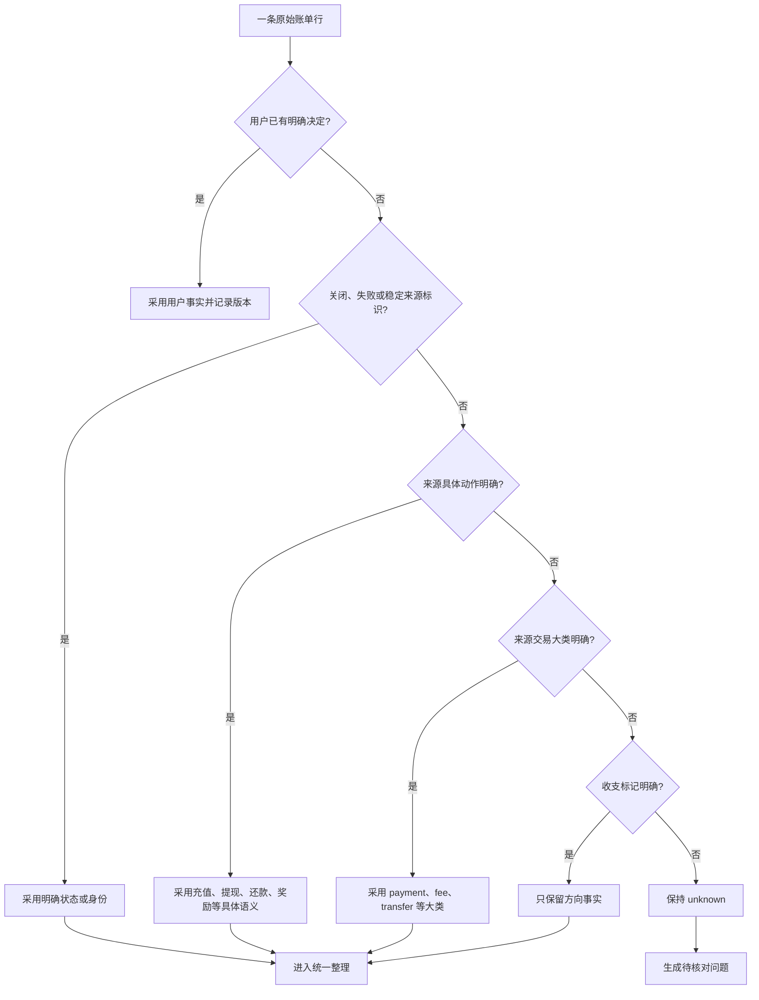

| 优先级 | 事实 | 能决定什么 | 不能决定什么 |
| --- | --- | --- | --- |
| 1 | 用户确认、排除、账户映射、退款关系 | 当前用户的最终业务事实 | 不能改写不可变原始证据 |
| 2 | 稳定来源单号、明确成功/退款/关闭/失败状态 | 来源身份、经济效果 | 不能仅凭单号推断分类或账户 |
| 3 | 来源具体动作 | 奖励、充值、提现、还款、余额宝移动等 | 不能把普通对人转账当本人账户 |
| 4 | 来源交易大类 | payment、fee、transfer、other | 不能覆盖更具体动作 |
| 5 | 收入、支出、不计收支 | 资金方向 | “收入”不自动证明是工资；“不计收支”不自动证明是本人转账 |
| 6 | 商户、商品、备注、金额、时间 | 同事件或退款候选材料 | 不能单独成为来源身份，也不能单独自动合并 |

## 3. 文件上传、重复文件与重解析

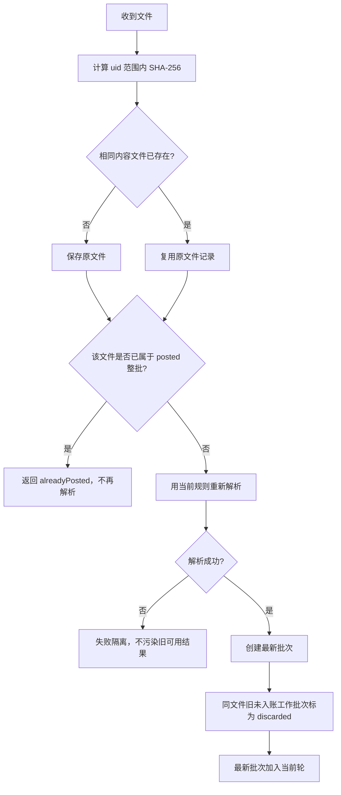

| 场景 | 当前行为 | 保留内容 | 用户结果 |
| --- | --- | --- | --- |
| 第一次上传 | 保存文件并解析 | 原文件、批次、所有物理行 | 进入当前轮 |
| 同内容再次上传，尚未入账 | 复用文件，用最新规则新建批次 | 旧证据仍可追溯；旧工作批次 `discarded` | 只展示最新批次，不要求用户选择“旧结果/新结果” |
| 同内容再次上传，已经整批入账 | 不读取、不重解析、不建新批次 | 已入账批次和交易关系 | 明确提示已经入账 |
| 新解析失败 | 不替换已有可用批次 | 失败原因与原文件 | 修正格式或显式选择后再试 |
| 部分入账 | 产品不支持此状态 | 无 | 一批要么整体入账，要么整体未入账 |

这里的“丢弃”是**退出当前工作流并隐藏**，不是删除原始证据。已经形成正式交易的批次不能静默重算；需要修改时走撤销或重建流程。

## 4. 解析器选择

### 4.1 选择流程

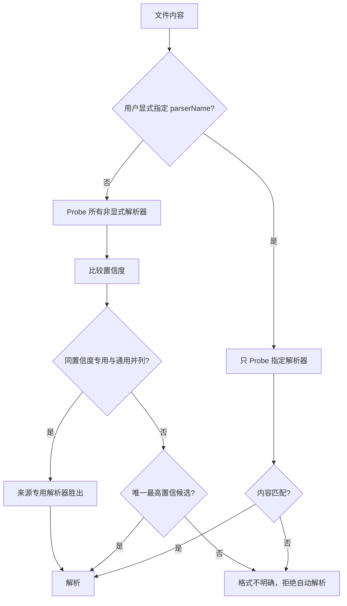

文件名和扩展名只辅助判断容器；来源识别必须依赖内容签名、表头和结构。通用银行是兜底，不能抢占同置信度的支付宝或微信专用解析器。

### 4.2 当前解析器注册表

| 来源 | 格式 | 选择 | parser / normalization | 现行能力 | 边界 |
| --- | --- | --- | --- | --- | --- |
| 支付宝 App | CSV | 自动 Probe | `alipay-evidence-parser-v1` / `alipay-normalization-v2` | App 表头、物理行、交易号、订单号、付款方式、来源具体动作 | 旧批次不会原地改变 |
| 支付宝 Web | CSV | 自动 Probe | 同上 | Web 表头、交易号、商户订单号，共用支付宝语义 | 常缺付款方式，需要账户层补充 |
| 微信支付 | CSV | 自动 Probe | `wechat-csv-parser-v1` / `wechat-normalization-v1` | UTF-8/中文编码、表头别名、物理行、状态、退款、单号 | 来源结构不匹配时拒绝 |
| 微信支付 | XLSX | 自动 Probe | `wechat-xlsx-parser-v1` / `wechat-normalization-v1` | 多工作表、sheet 行定位、公式单元格检查 | 不支持 `.xls` 微信模板 |
| 光大信用卡 | 文本层 PDF | 显式选择 | `ceb-credit-pdf-parser-v3` / `ceb-credit-pdf-normalization-v1` | 固定月结单、账期、账单日、还款日、额度、卡尾号 | 不是 OCR，不是通用 PDF |
| 通用银行 | CSV | 自动推断或确认 | `generic-bank-csv-parser-v2` / `generic-bank-normalization-v2` | UTF-8/GB18030/GBK，逗号/制表符，扫描表头与样例 | 只接受唯一安全推断 |
| 通用银行 | XLS | 自动推断或确认 | `generic-bank-xls-parser-v2` / 同上 | 复用原项目 MSCFB 读取能力 | 不按银行复制 parser |
| 通用银行 | XLSX | 自动推断或确认 | `generic-bank-xlsx-parser-v2` / 同上 | 复用 OOXML 读取能力、多 sheet | 不猜单列正负方向 |

### 4.3 系统规范字段与各来源列对照

解析器先把不同账单列投影到同一套 `CanonicalRawEvidence`，再生成 `NormalizedEvidence`。原始列名、原始顺序和值仍完整保存在 `RawFields`；下表只说明参与统一判断的规范投影，不代表删除未列出的账单字段。

| 系统规范字段 | 业务含义 | 支付宝 App / Web | 微信 CSV / XLSX | 通用银行 CSV / XLS / XLSX | 光大信用卡 PDF |
| --- | --- | --- | --- | --- | --- |
| `TransactionTime` | 交易发生时间 | `交易时间`、`交易创建时间` | `交易时间`、`交易日期` | `交易时间`、`交易日期`、`交易日`、`Trans Date` 等时间别名 | `交易日` |
| `Amount` | 原始金额文本；标准化后为非负最小货币单位 | `金额`、`金额(元)`、`金额（元）` | `金额(元)`、`交易金额(元)`、`金额` | 单金额列，或分别使用收入列与支出列 | `金额`；入账金额的前置标记同时决定方向 |
| `Direction` | 账单声明的收入、支出或中性方向 | `收/支` | `收/支`、`收支`、`收支类型` | `收支`、`交易方向`、`借贷标志`等；也可由正负号或收入/支出双列推导 | 入账标记为收入，其余为支出 |
| `Status` | 成功、退款、关闭、失败等来源状态 | `交易状态` | `当前状态`、`交易状态`、`状态` | 可选 `交易状态`、`状态`；现行通用银行只保留原文，不据此扩展平台状态语义 | 无独立状态列，结构合法的账单交易按正常处理 |
| `TransactionType` | 来源交易大类或产品动作 | `交易分类`、`交易类型`、`类型` | `交易类型`、`业务类型` | 可选 `交易类型`、`交易分类`、`类型` | 无；统一为 `other` |
| `Counterparty` | 商户、收付款对象或交易说明 | `交易对方` | `交易对方`、`交易对象`、`对方` | `交易对方`、`对方户名`、`商户名称`、`交易摘要`等 | `交易说明` |
| `Item` | 商品或用途说明 | `商品说明`、`商品名称` | `商品`、`商品说明`、`商品名称` | `商品说明`、`交易用途`、`摘要`等 | 无独立投影；交易说明仍参与身份指纹 |
| `PaymentMethod` | 付款、收款或来源账户显示文本 | `收/付款方式`、`付款方式`、`资金渠道` | `支付方式`、`付款方式` | `支付方式`、`卡号`、`尾号4位`等 | 由卡号末四位合成为 `末四位xxxx` |
| `Note` | 不参与核心金额方向的补充说明 | `备注` | `备注`、`交易备注` | `备注`、`附言`、`note`、`remark` | `记账日` |

来源稳定编号独立于上面的业务字段保存；它们优先用于来源身份和精确去重，不能用商户、金额或日期替代。

| 系统身份字段 | 支付宝列 | 微信列 | 通用银行列 | 光大信用卡 PDF | 缺失时 |
| --- | --- | --- | --- | --- | --- |
| `TransactionId` | `交易订单号`、`支付宝交易号`、`交易号` | `交易单号`、`微信交易单号` | `交易流水号`、`流水号`、`交易号`、`reference no` 等 | 无 | 使用版本化强指纹候选，不把同额近时直接视为同一笔 |
| `OrderId` | `订单号` | `订单号` | `订单号`、`order id`、`order no` | 无 | 可为空 |
| `MerchantOrderId` | `商家订单号`、`商户订单号` | `商户单号`、`商家单号` | 仅显式列映射时使用 | 无 | 可为空 |

账单列不会直接写入正式账本字段。整理层还要结合来源动作、账户映射、关系和人工事实，生成下列事件字段：

| 最终事件字段 | 主要来源 | 为什么不能只复制某一列 |
| --- | --- | --- |
| `eventUnixTime` | 标准化交易时间 | 需要时区、格式和合法性校验 |
| `amount` / `currency` | 标准化金额与本批币种 | 金额必须转为最小货币单位，方向与符号分离 |
| `flowDirection` | 标准方向 + 经济性质 | 退款、还款和本人转账不能只按账单“收入/支出”记账 |
| `economicNature` | 来源动作、状态、方向和关系规则 | `转账`可能是对人收支，也可能是本人账户移动 |
| `ledgerAccountId` | 来源账户或付款方式映射 | 账单显示文本不是核心账本账户 ID |
| `counterpartyLedgerAccountId` | 转账、还款、借入的另一侧账户映射 | 只有双边资金事件需要，且两端账户必须不同 |
| `categoryId` | 自动分类规则或用户确认 | 商户和商品只提供分类线索，不是正式分类 ID |
| 证据与来源身份 | 稳定编号、强指纹、原始行定位 | 必须保留可审计关系，不能把规范摘要当成原始证据 |

## 5. 原始行、标准化行与错误隔离

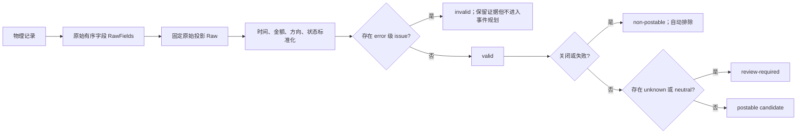

| 层 | 保存内容 | 例子 | 是否可改 |
| --- | --- | --- | --- |
| 原始有序字段 | 每一列的原名和值 | “交易对方”“金额(元)” | 不可变 |
| 物理定位 | CSV 起止行；XLS/XLSX sheet 与行；PDF 页和页内行 | `sheet 1 / row 23` | 不可变 |
| 固定原始投影 | 时间、金额、方向、状态、类型、对方、商品、支付方式、备注 | 来源缺失时空字符串 | 不可变 |
| 标准化结果 | Unix 时间、最小货币单位金额、ISO 币种、方向、类型、经济效果 | `expense / payment / refund` | 随新批次和版本重算，不覆盖旧行 |
| issue | 缺字段、格式错误、未知状态、公式、额外列等 | warning 或 error | 随解析版本冻结 |

| 标准化字段 | 合法结果 | 关键规则 |
| --- | --- | --- |
| 时间 | Unix 秒 + 固定时区偏移 | 缺失或非法为 error；银行可支持日期或日期时间 |
| 金额 | 非负最小货币单位整数 | 方向与正负号分开表达；平台负数金额不作为正常金额接受 |
| 币种 | 三位大写 ISO 4217 | 必须与映射账户币种一致 |
| 方向 | `income` / `expense` / `neutral` / `unknown` | `/`、不计收支进入 neutral；不能凭 neutral 自动判转账 |
| 交易类型 | `payment` / `transfer` / `top_up` / `withdrawal` / `fee` / `other` / `unknown` | 来源具体动作优先于宽泛关键词 |
| 经济效果 | `normal` / `refund` / `closed` / `failed` / `unknown` | 状态优先于动作；失败退款仍是 failed，不是 refund |

## 6. 支付宝规则

### 6.1 动作判定树

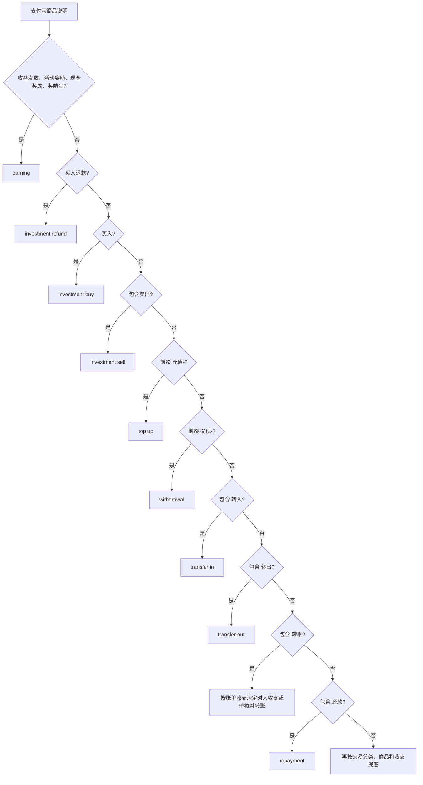

顺序是规则的一部分。“收益发放”必须先于“投资理财”，“普通转账”必须区分明确收入/支出和不计收支。

### 6.2 支付宝动作明细

| 原始特征 | 标准方向/类型 | 资金投影 | 自动成立条件 | 不成立时 |
| --- | --- | --- | --- | --- |
| `-收益发放`、活动/现金奖励、奖励金 | 强制 `income + other` | 单边收入到实际账户 | 时间、金额、状态、账户完整 | 只核对账户或核心字段 |
| `-买入` | 原方向 + transfer | 付款方式 → 投资目标 | 两端账户都唯一映射 | 转账双方待确认 |
| `-买入退款` | 原方向 + transfer | 投资目标 → 付款方式 | 退款语义和两端账户明确 | 关系或账户待确认 |
| 包含 `-卖出` | 原方向 + transfer | 投资目标 → 付款方式 | 两端明确 | 转账双方待确认 |
| `充值-...` | `top_up` | 外部付款账户 → 支付宝账户余额 | “支付宝账户余额”和外部账户都已映射 | 缺哪端确认哪端 |
| `提现-...` | `withdrawal` | 支付宝账户余额 → 对方账户 | 钱包及对方账户唯一 | 转账双方待确认 |
| 包含余额宝的 `转入` | transfer | 付款方式 → 余额宝 | 付款方式与余额宝均映射 | 转账双方待确认 |
| 包含余额宝的 `转出` | transfer | 余额宝 → 付款方式 | 两端均映射 | 转账双方待确认 |
| 其他明确 `转入` / `转出` | transfer | 按付款方式与目标投影 | 证据能表达本人两端且映射唯一 | 人工确认，不把对方强当本人账户 |
| 普通对人 `转账`，账单为收入/支出 | `payment`，保留收入/支出 | 不做本人双账户投影 | 后续经济性质规则可直接判定时 | 经济性质待确认 |
| 普通对人 `转账`，账单为不计收支 | transfer | 付款方式 → 对方候选 | 两端能证明是本人账户 | 转账双方待确认 |
| 包含 `还款` | transfer + repayment 投影 | 付款方式 → 还款目标 | 精确账户或唯一信用卡家族映射 | 还款双方待确认 |

支付宝 App 中“余额”和“账户余额”统一为同一个不可逆别名，界面显示“支付宝账户余额”。这只统一钱包名称，不把账单归属身份、银行卡或余额宝混为一个账户。

### 6.3 支付宝状态

| 原始状态 | 经济效果 | 后续处理 |
| --- | --- | --- |
| 交易成功、支付成功、等待确认收货、还款成功、交易完成、已完成、收款成功、成功 | normal | 继续判断经济性质 |
| 退款成功、退税成功、已退款 | refund | 进入退款原交易匹配 |
| 交易关闭、已关闭、交易取消、已取消、交易撤销、已撤销 | closed | 保留证据，自动排除 |
| 交易失败、支付失败、收款失败、还款失败、失败 | failed | 保留证据，自动排除 |
| 其他 | unknown | 状态待核对，不猜成功 |

## 7. 微信支付规则

### 7.1 动作与状态双重判定

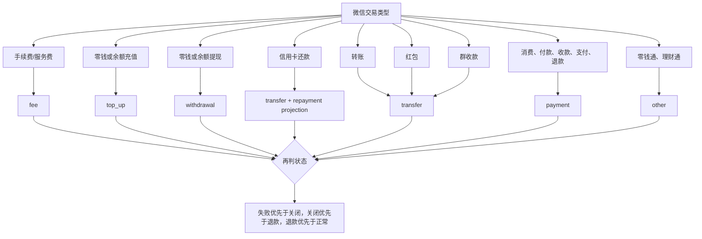

### 7.2 微信动作明细

| 匹配顺序 | 原始交易类型包含 | 标准类型 | 双边资金投影 |
| --- | --- | --- | --- |
| 1 | 手续费、服务费 | fee | 无；作为单边费用 |
| 2 | 零钱充值、余额充值 | top_up | 付款方式 → 微信零钱 |
| 3 | 零钱提现、余额提现 | withdrawal | 微信零钱 → 付款方式 |
| 4 | 信用卡还款 | transfer | 付款方式 → 还款目标，性质为 repayment |
| 5 | 转账 | transfer | **当前不自动投影本人双账户**；对人转账需结合方向判断 |
| 6 | 红包 | transfer | **当前不自动投影本人双账户** |
| 7 | 群收款 | transfer | **当前不自动投影本人双账户** |
| 8 | 消费、付款、收款、支付、退款 | payment | 单边经济收支或退款 |
| 9 | 零钱通、理财通 | other | 当前没有统一双边投影，按证据继续核对 |
| 10 | 其他 | unknown | 待核对 |

| 状态判定顺序 | 命中内容 | 经济效果 | 原因 |
| --- | --- | --- | --- |
| 1 | 失败、未支付、未收款 | failed | “退款失败”不能被后面的“退款”覆盖 |
| 2 | 关闭、撤销、取消 | closed | 不形成真实资金事件 |
| 3 | 退款成功、退款完成、已退款、已退还、已全额/部分退款 | refund | 明确退款 |
| 4 | 交易类型含退款，状态含成功、完成、到账 | refund | 状态与类型组合证明退款 |
| 5 | 成功、完成、已收钱、已到账、已支付、已存入、已转账、已领取 | normal | 明确成功 |
| 6 | 其他 | unknown | 不猜 |

微信提现到银行卡的正确账户关系是“微信零钱 → 银行卡”，微信信用卡还款是“付款方式 → 信用卡”。账单归属的微信身份不是微信零钱账户；必须通过“微信零钱”别名或批次已确认账户解析平台侧，不能把同一行银行卡同时填成转出和转入端。

## 8. 银行账单规则

### 8.1 通用银行表格不是“每家银行一套模板”

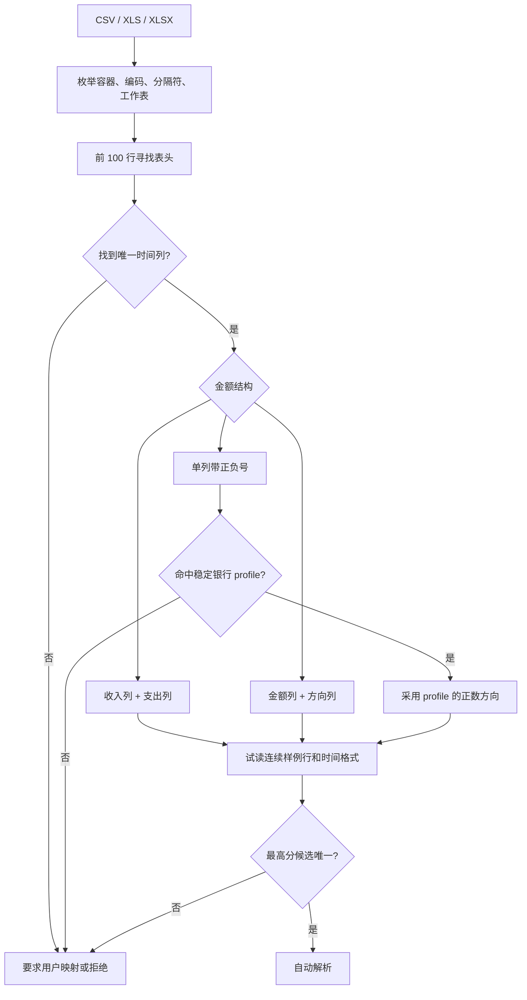

| 推断项目 | 当前规则 | 安全限制 |
| --- | --- | --- |
| 表头位置 | 每个工作表前 100 行扫描 | 时间列必须唯一 |
| 数据起点 | 表头后最多 5 行内尝试 | 必须形成连续合法样例 |
| 时间格式 | 秒、分钟、斜杠、紧凑日期、纯日期等固定集合 | 不做自由文本时间猜测 |
| 金额模式 A | 收入列 + 支出列 | 两列都存在才采用 |
| 金额模式 B | 金额列 + 方向列 | 方向值只认显式别名集合 |
| 金额模式 C | 单列正负金额 | 必须命中稳定 profile，或用户明确正数方向 |
| CSV | UTF-8、GB18030、GBK；逗号或制表符 | 内容必须像文本且存在多列 |
| 候选选择 | 基础分 + 连续有效行 + 可选证据列；profile 额外高分 | 最高分并列时拒绝自动选择 |

### 8.2 当前声明式银行 profile

| 银行/载体 | 稳定表头签名 | 金额方向 | 付款方式 |
| --- | --- | --- | --- |
| 兴业信用卡中文表 | 交易日期、记账日期、交易金额、交易摘要、尾号4位 | 正数=信用卡消费流出，负数=信用卡账户流入；含还款信号后再整理为还款 | 前缀“兴业银行信用卡” + 卡尾号 |
| 兴业信用卡英文表 | Trans Date、Post Date、Amount、Tran Description、Card No. | 同上 | 同上 |

兴业 `.xls` 不需要用户为每家银行手写完整模板；命中上述表头就自动识别。新增银行时优先增加表头别名或小型 profile，只有文件结构完全不同才新增专用 parser。

### 8.3 光大信用卡 PDF

| 事实 | 当前解释 |
| --- | --- |
| 格式 | 只接受既定、带文本层的光大月结单 |
| 方向 | 交易说明含“(存入)”为信用卡流入，其余为信用卡支出 |
| 对方/商品 | 交易说明写入交易对方，商品保持空 |
| 账户 | “光大银行信用卡 + 卡尾号”形成付款方式候选 |
| 身份 | 没有稳定流水号时使用文件 SHA-256 + PDF 物理定位 |
| 页眉 | 账期、账单日、到期还款日、额度随批次保存；缺失不猜 |
| 边界 | 不做 OCR，不做“中国信用卡 PDF 万能解析” |

## 9. 来源身份与精确去重

来源身份回答的是“这是不是同一来源系统里的同一条记录”，不是“它们是不是同一个现实经济事件”。

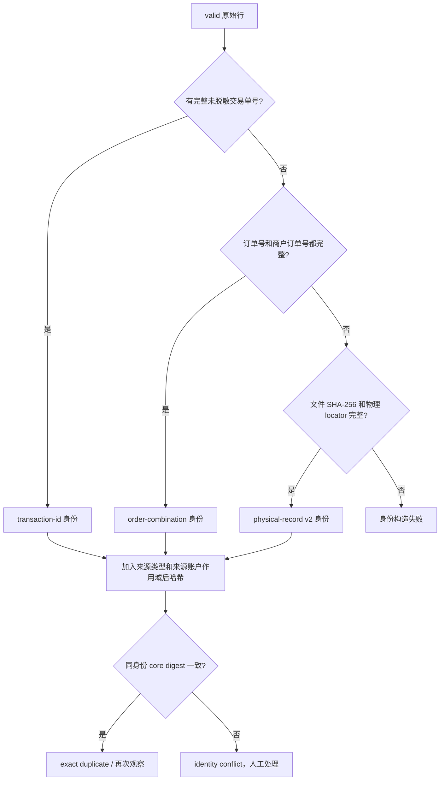

| 材料 | 能否作为精确身份 | 说明 |
| --- | --- | --- |
| 完整交易单号 | 是，优先级最高 | 脱敏值不能用 |
| 完整订单号 + 完整商户订单号 | 是 | 必须两者都有 |
| 文件 SHA-256 + 物理定位 | 是，identity-v2 | 保证同文件相同位置重解析收敛；不同物理行不会因内容相同被误并 |
| 金额、时间、方向、商户、商品 | 否 | 只用于 core conflict 或跨来源候选 |
| 内容指纹 | 否 | 旧 identity-v1 的内容指纹不再用于折叠不同物理行 |

core digest 只包含金额、币种、来源方向和经济效果。同一来源身份若这些核心事实冲突，必须保留两份证据并进入 `identity_conflict`，不能用新值覆盖旧值。

## 10. 账户发现、映射、复用与忽略

### 10.1 三种账户不要混淆

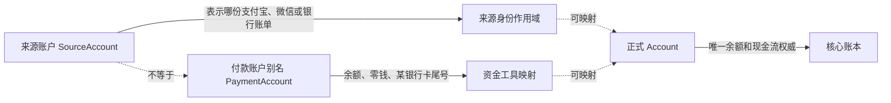

| 对象 | 例子 | 用途 | 修改后的影响 |
| --- | --- | --- | --- |
| 来源账户 | 某微信昵称、某支付宝账号、一份银行来源档案 | 隔离来源身份与批次 | 改展示或正式账户映射，不改变历史来源身份 |
| 付款账户别名 | 微信零钱、支付宝余额、某银行信用卡尾号 | 解析每行资金从哪里来、到哪里去 | 后续批次可复用；已有证据不改 |
| 正式账户 | 现金、储蓄卡、信用卡、余额宝 | 核心余额与交易 | 是最终入账对象 |

### 10.2 付款账户别名规则

| 规则 | 当前行为 |
| --- | --- |
| 规范化 | NFKC、清理空白和遮罩、长卡号只保留后四位、去“尾号/末四位/卡号”词 |
| 角色词 | 银行“主卡”不参与账户身份 |
| 平台钱包 | 支付宝“余额/账户余额”同一别名；显示“支付宝账户余额”；微信“零钱”显示“微信零钱” |
| 优惠组合 | `付款工具 & 优惠券/红包` 只有一个真实资金工具时，去掉优惠段 |
| 无辨识度文本 | “银行卡”“信用卡”“未知”“其他”等不生成可复用别名 |
| 跨来源复用 | 仅银行卡名称、卡种、尾号和币种形成唯一一致映射时复用 |
| 冲突 | 同一别名或同一信用卡家族指向多个正式账户时不选边 |
| 信用卡家族 | 还款对方可按发卡行信用卡家族寻找唯一卡；尾号身份仍保留，不被家族名替代 |

### 10.3 核对账户弹窗的长期行为

弹窗应一直展示本轮发现的资金账户，而不是只展示“未处理”项。

| 账户状态 | 弹窗展示 | 整理行为 | 用户可做什么 |
| --- | --- | --- | --- |
| 已映射 | 显示已使用的正式账户 | 自动复用 | 修改映射 |
| 未映射 | 显示“请选择或创建账户” | 相关事件待处理 | 选择现有账户或创建账户 |
| 本轮忽略 | 显示本轮已跳过 | 该别名相关行本轮不整理 | 恢复并选择账户 |
| 长期忽略 | 显示长期忽略 | 当前轮及后续导入自动忽略 | 取消长期忽略 |

长期忽略会在每次开始整理前再次应用，避免非 Web 入口绕过账户策略；它不删除原始行。取消忽略后，该账户可重新加入后续轮次。

## 11. 从证据行组织成经济事件

### 11.1 固定执行顺序

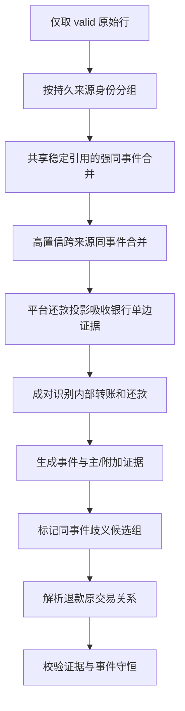

该顺序不能随意交换。先按来源身份去重，再跨来源合并；先形成事件，再解析退款关系。

### 11.2 单事件经济性质判定顺序

| 顺序 | 条件 | 事件性质 | 初始结果 |
| --- | --- | --- | --- |
| 1 | 全部证据已忽略、已链接、non-postable、关闭或失败 | 排除 | excluded |
| 2 | 核心字段冲突或来源身份冲突 | 未知 | needs action |
| 3 | 两条相反方向证据唯一配对 | internal transfer 或 repayment | 账户完整则 ready |
| 4 | refund 效果但来源方向仍为支出 | expense | ready；表示原支出行带部分退款状态，不把它当退款入账 |
| 5 | refund 效果且为流入 | refund | 必须找到唯一原交易关系 |
| 6 | 来源已投影双边资金动作 | internal transfer 或 repayment | 两端不同且完整则 ready |
| 7 | 信用卡账户流入且文本有还款信号 | repayment | 还款转出端待确认 |
| 8 | fee + 支出 | fee | ready |
| 9 | normal + 支出 + 非转账类 | expense | ready |
| 10 | normal + 收入 + `other` + 非转账类 | income | ready |
| 11 | transfer/top_up/withdrawal 但未形成完整双边关系 | 未知、neutral | 转账双方待确认 |
| 12 | 其他 | 未知 | 经济性质待确认 |

**现行保守边界：** 普通平台“收款/转账收入”经标准化通常是 `payment + income`，不满足第 10 条的 `other` 条件，所以当前仍会要求确认经济性质。明确“收益发放/奖励”会被支付宝改成 `other + income`，可以自动成为收入。若产品决定“所有明确成功的普通收入都直接作为 income”，必须修改整理器、补反例测试并提升相关规则版本，不能只改文案。

## 12. 跨账单同一事件合并

### 12.1 强引用合并

两组证据共享至少 6 个字符的稳定交易号、订单号或商户订单号时，仍必须全部满足兼容条件才合并。

| 条件 | 必须满足 |
| --- | --- |
| 正式账户 | 相同 |
| 金额、币种、方向 | 相同，方向不能 unknown/neutral |
| 时间 | 相差不超过 72 小时 |
| 来源账户 | 不能是同一个来源账户 |
| 语义 | 两边都必须是 normal 的 payment 或 fee |
| 多候选 | 同一个稳定引用涉及的所有组必须两两兼容，否则整组不自动合并 |

### 12.2 无共享单号的高置信合并

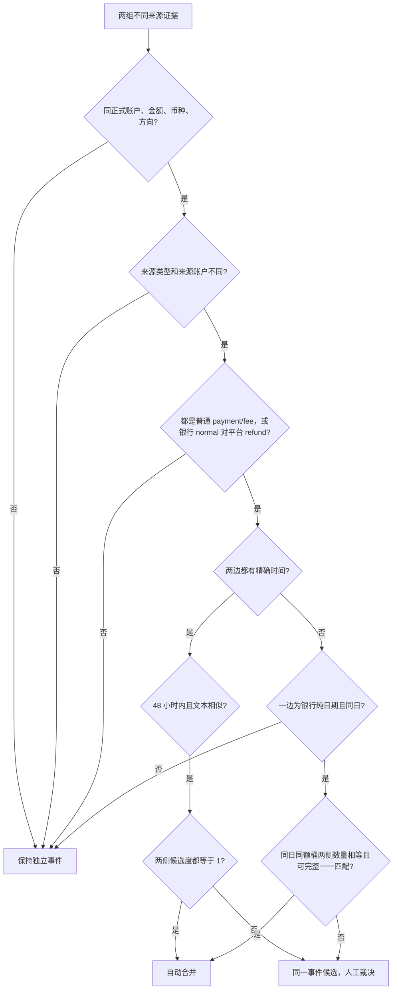

| 模式 | 自动合并要求 | 为什么这么严格 |
| --- | --- | --- |
| 精确时间跨来源 | 同账户、同额、同币种、同方向、48 小时内、文本包含或相等、双方唯一候选 | 防止同商户连续同额消费误并 |
| 银行只有日期 | 同日同账户同额同方向，平台侧与银行侧数量相等，整桶能完整一一匹配 | 没有时分秒时不能靠最近时间选一个 |
| 平台部分退款 + 银行退款入账 | 银行可为 normal、平台为 refund，但其余强条件都要满足且唯一 | 银行常只表达入账方向，平台才表达退款性质 |
| 多个可能匹配 | 不自动合并，生成 same-event 问题 | 金额时间不是身份 |

因此“银行和微信各一条”只有在两份账单都上传、账户均已映射并满足以上条件后，界面才显示“2 条原始记录”。只有银行行或只有平台行时，显示“1 条原始记录”是正确的。

## 13. 内部转账、充值提现与信用卡还款

### 13.1 双边关系

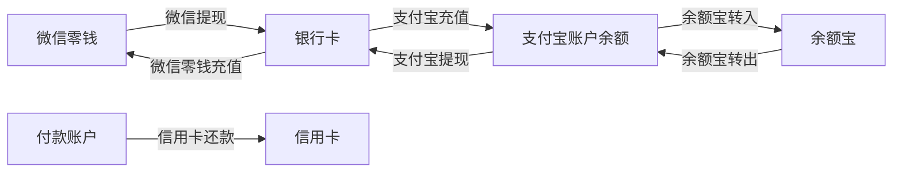

| 场景 | 转出端 | 转入端 | 自动确认要求 |
| --- | --- | --- | --- |
| 微信零钱充值 | 付款方式 | 微信零钱 | 两端唯一映射且不同 |
| 微信零钱提现 | 微信零钱 | 付款方式银行卡 | 两端唯一映射且不同 |
| 支付宝充值 | 外部付款账户 | 支付宝账户余额 | 两端唯一映射且不同 |
| 支付宝提现 | 支付宝账户余额 | 外部目标账户 | 两端唯一映射且不同 |
| 余额宝转入 | 支付方式 | 余额宝 | 两端唯一映射且不同 |
| 余额宝转出 | 余额宝 | 支付方式 | 两端唯一映射且不同 |
| 信用卡还款 | 资产账户 | 信用卡负债账户 | 来源投影或两条账单证据唯一对应 |
| 普通本人账户互转 | 支出账户 | 收入账户 | 同额同币种、72 小时内、方向相反、双方唯一且都是 transfer-like |

### 13.2 平台还款与银行账单合并

平台行已经能确定“付款账户 → 信用卡”时，银行还款行可作为同一事件的附加证据，而不是再生成一条收入。

| 条件 | 信用卡侧银行行 | 付款资产侧银行行 |
| --- | --- | --- |
| 账户 | 等于投影的还款目标 | 等于投影的付款来源 |
| 方向 | 信用卡流入 | 资产账户支出 |
| 账户类型 | liability / 信用卡 | asset |
| 金额、币种 | 与平台行相同 | 与平台行相同 |
| 时间 | 72 小时内 | 72 小时内 |
| 文本 | 含还款、款项转入、repayment、payment received、card payment 等信号 | 同样需要还款信号 |
| 候选数 | 平台某一账户侧唯一，且银行行也只对应一个平台事件 | 同左 |

同一发卡行存在多张信用卡且平台只写“某银行信用卡还款”时，不能按银行名猜尾号；保持“还款双方待确认”。

## 14. 退款与部分退款

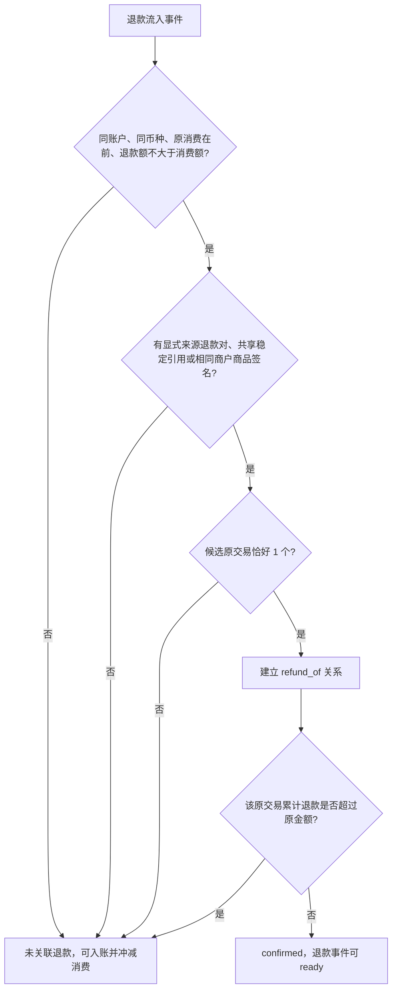

| 判断项 | 当前规则 |
| --- | --- |
| 原交易性质 | 必须是 expense，且未排除 |
| 账户与币种 | 与退款事件相同 |
| 时间 | 原交易不能晚于退款 |
| 金额 | 单笔退款不得大于原交易；同一原交易累计退款不得超过原金额 |
| 关系证据 | 显式部分退款对、共享稳定引用，或相同“交易对方 + 商品”签名 |
| 唯一性 | 恰好一个候选才自动确认 |
| 部分退款特殊对 | 原支出行和退款流入行都标为 refund、72 小时内、同商户、状态中明确退款金额且等于流入金额 |
| 最终入账 | 退款始终作为独立流入事件；唯一强候选存在时用 `refund_of` 指向原消费，否则按未关联退款入账；两者均冲减消费、不计收入 |

“买 57.77 元，退 0.20 元”应形成一笔 57.77 元消费和一笔 0.20 元退款关系。银行侧 57.77 元支出可与平台原消费合并为同一事件；银行侧 0.20 元入账可与平台退款合并为同一事件。任一侧缺失时仍保留单一来源证据，不伪造第二条记录。

## 15. 待处理问题如何生成

问题卡片代表“一次用户决定”，不是一笔合并交易。多个独立事件若需要完全相同的决定，可以进入同一张批量问题卡；它们仍是多笔独立事件。

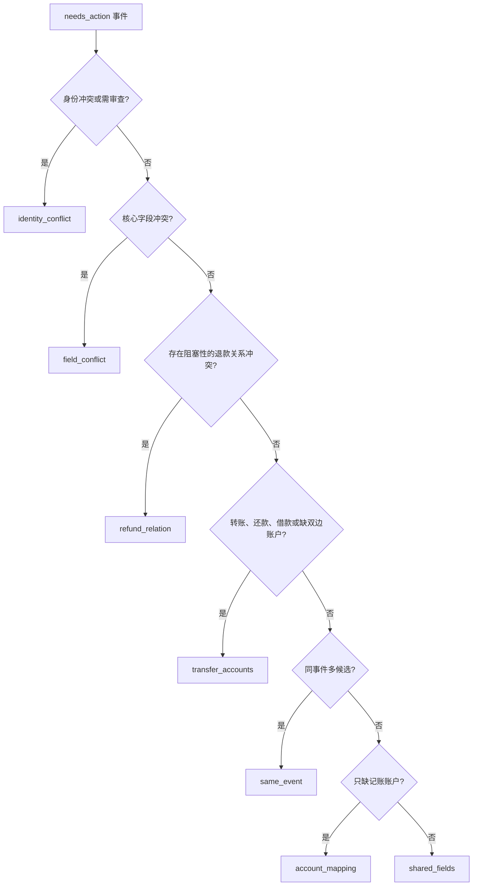

| 主原因码 | 问题类型 | 用户要决定什么 | 可批量 |
| --- | --- | --- | --- |
| `identity_conflict` / `identity_review_required` | identity_conflict | 是同一来源记录、冲突证据还是独立记录 | 否 |
| `core_fields_conflict` | field_conflict | 时间、金额、币种、方向等采用哪个事实 | 否 |
| `refund_relation_ambiguous` / `refund_amount_exceeded` / `refund_relation_invalid` | refund_relation | 处理已经存在但相互冲突的退款关系；单纯未找到原消费不会生成问题 | 否 |
| `transfer_account_required` / `repayment_account_required` / `borrow_account_required` | transfer_accounts | 选择转出和转入账户 | 是，相同签名才合并问题卡 |
| `relation_ambiguous` 且非上述双边性质 | same_event | 哪些证据属于同一事件 | 否 |
| `ledger_account_required` | account_mapping | 选择或创建正式账户 | 是，相同来源付款方式才合并问题卡 |
| `economic_nature_required` / `core_fields_missing` / `postability_direction_conflict` | shared_fields | 经济性质或缺失字段 | 是，相同判定签名才合并问题卡 |

批量问题签名包含经济性质、资金方向、原因族，以及每条证据的来源类型、来源账户、标准类型、经济效果、方向、币种、原始类型、对方、商品和付款方式。签名相同才共用一个决定。

| 界面数字 | 正确含义 |
| --- | --- |
| `1 项` | 当前问题卡包含 1 个待决定事件 |
| `多笔需相同判断` | 仅在同一问题卡确有多个独立事件时显示 |
| `1 条原始记录` | 当前事件只有 1 条证据 |
| `2 条原始记录` | 两个来源行已被证明属于同一事件 |
| `附加证据` | 被同事件合并的非主证据，不是被删除的交易 |

## 16. 可入账门禁与整批原子入账

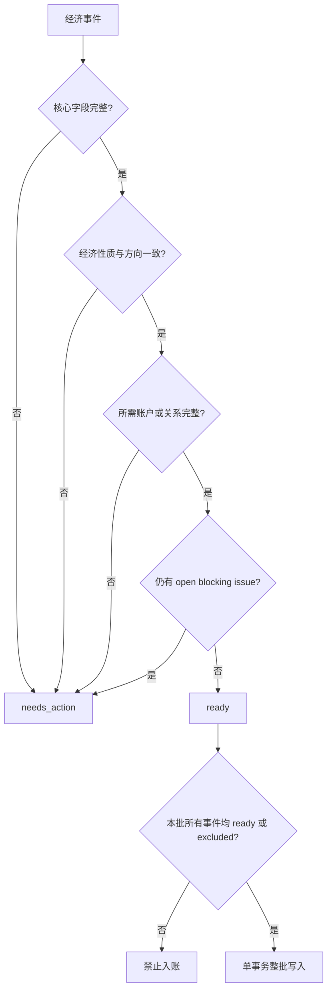

| 经济性质 | 必须方向 | 额外条件 |
| --- | --- | --- |
| income | inflow | 一个正式记账账户 |
| expense | outflow | 一个正式记账账户；分类可为空 |
| fee | outflow | 一个正式记账账户 |
| refund | inflow | 恰好一个已确认原交易关系或原交易链接 |
| internal_transfer | neutral | 两个不同正式账户 |
| repayment | neutral | 资产转出账户与不同的负债转入账户 |
| borrow | neutral | 两个不同正式账户 |
| balance_adjustment | 当前阻塞 | 核心账本需要目标余额与差额，现行事件只有一个金额，不能无损映射 |

核心字段是记账账户、有效时间、非负金额和三位币种。`category_unclassified` 只是提示，不阻塞支出入账。身份冲突、字段冲突、关系歧义、退款超额和任何打开的 blocking issue 都是硬阻塞，普通字段编辑不能把它们偷偷清除。

计数必须满足：

`有效原始证据数 - 同事件附加证据数 = 最终事件数 = ready + needs_action + excluded`

## 17. 常见真实场景对照

| 原始场景 | 解析结果 | 账户/关系判断 | 预期结果 |
| --- | --- | --- | --- |
| 微信“零钱提现”，对方为某储蓄卡 | withdrawal + normal | 微信零钱 → 该储蓄卡 | 两端已映射则内部转账 ready；否则只确认缺失端 |
| 微信“信用卡还款”，付款方式为零钱，交易对方为某信用卡 | transfer + repayment | 微信零钱 → 信用卡 | 两端唯一映射则 ready；银行还款行可作为附加证据 |
| 支付宝“余额宝转出到余额” | transfer | 余额宝 → 支付宝账户余额 | 两端已映射则内部转账 ready |
| 支付宝活动奖励，收入 | other + income | 单边进入实际账户 | 账户完整则收入 ready |
| 支付宝/微信普通朋友转账，明确收入 | payment/transfer + income | 不是本人双账户 | **现行普通 income 仍可能需要确认性质；这是整理器保守边界** |
| 微信/支付宝普通消费，成功、支出 | payment + normal + expense | 映射付款账户 | 自动 expense ready |
| 财付通快捷—平台商户的银行支出 + 微信同额消费 | 两条普通支付证据 | 同账户、同额、同方向、时间/文本和唯一性满足才合并 | 满足则一个消费事件、2 条证据；否则各自保留 |
| 平台消费 57.77，部分退款 0.20，银行也各有一行 | 原消费 + 退款两种事件 | 各自跨来源合并，再建立 `refund_of` | 两个经济事件，每个可有 2 条证据 |
| 只有银行消费行，平台账单未上传或没匹配上 | 单条银行证据 | 无可合并平台证据 | 一个消费事件、1 条证据 |
| 信用卡还款只写发卡行，没有尾号，且该行有多张卡 | repayment 候选 | 信用卡家族歧义 | 还款双方待确认，不猜卡 |
| 支付方式为“支付宝小荷包”，用户长期忽略 | 原始行保留 | 别名处于 exclusion | 当前轮和后续轮自动排除；弹窗仍显示可恢复 |
| 失败、关闭、未支付 | failed/closed | 无真实资金结果 | 自动 excluded，不进入正式交易 |

## 18. 原项目成熟能力的复用边界

| 原项目能力 | 现在怎么复用 | 为什么不直接调用旧写账流程 |
| --- | --- | --- |
| 支付宝 App/Web CSV | 复用字段读取、来源动作、状态和资金方向语义 | 旧流程没有不可变证据、来源身份和跨文件裁决 |
| 微信 CSV/XLSX | 复用动作、状态、退款与账户方向 | 同上；单文件导入和整理必须调用同一分类器 |
| Excel `.xls` / `.xlsx` 读取 | 通用银行 parser 直接复用 MSCFB/OOXML 载体能力 | 载体读取成熟，但银行字段和方向仍要安全推断 |
| 自定义 CSV/Excel | 作为长尾银行显式映射入口 | 用户映射不能升级成全局猜测规则 |
| OFX/QFX、CAMT、MT940 | 保留原代码，当前不注册国内个人账单入口 | 更偏海外或企业交换格式 |
| GnuCash、Beancount、Firefly III 等 | 归入独立账本迁移 | 它们携带完整账户、分类和关系，不应与日常账单混用 |
| AI 图片/文本识别 | 仅可辅助人工录入 | 未逐字段确认前不能进入自动证据链 |

同一来源只能有一套共享具体语义。单文件传统导入暂时保留，但不能与个人财务整理各复制一份关键词和优先级；修正规则时两个入口的测试必须同时更新。

## 19. 新增或修改规则的检查表

### 19.1 版本怎么升

| 变化 | 提升版本 | 例子 |
| --- | --- | --- |
| 文件结构、表头、编码、物理行读取变化 | parser version | 新增 XLS sheet 规则、修改 PDF 行定位 |
| 方向、状态、动作、字段标准化变化 | normalization version | 奖励改为 income、退款失败优先级修正 |
| 来源身份材料或编码变化 | 中央 identity version | 从内容指纹改为文件 + locator |
| 付款账户别名规则变化 | payment-account alias version | 卡角色词或钱包别名规范变化 |
| 来源双边资金投影变化 | source-funds version | 提现两端或还款目标规则变化 |
| 跨来源合并或事件性质变化 | organizer plan/review rule version | 收入自动化、匹配窗口、唯一性变化 |

### 19.2 最小实现与测试矩阵

| 检查项 | 必须覆盖 |
| --- | --- |
| Probe | 不抢占其他专用来源；多候选拒绝；显式解析器不参与自动选择 |
| 载体 | 编码、BOM、分隔符、sheet、空行、超长字段、公式、取消上下文 |
| 基础字段 | 正常时间金额、缺失、非法、三位币种、方向 unknown/neutral |
| 状态 | normal、refund、closed、failed、unknown；冲突词优先级 |
| 动作 | 每个具体动作、宽泛兜底、反例和顺序覆盖 |
| 身份 | 稳定单号、完整订单组合、物理 locator、重复文件、核心冲突、同额独立行 |
| 账户 | 已映射、未映射、跨来源唯一复用、冲突不复用、长期忽略与恢复 |
| 同事件 | 强引用、精确时间、日期行、一对多歧义、同来源不误并 |
| 退款 | 全额、部分、多次退款、超额、多候选、无候选 |
| 转账/还款 | 两端完整、缺一端、同账户、银行附加证据、多卡歧义 |
| 入账 | 整批成功、任一阻塞整批失败、事务回滚、重复请求幂等 |
| 隔离与隐私 | `uid` 隔离、SQLite/MySQL/PostgreSQL、日志不含原始字段绑定值 |

### 19.3 修改步骤

1. 先记录来源事实：脱敏原始列、状态、动作、方向和账户角色，不先写商户关键词猜测。
2. 判断是载体差异、来源语义差异、账户映射问题，还是跨来源整理问题；只修改所属层。
3. 优先复用现有来源分类器和 Excel 读取器；稳定小差异注册 profile，不复制整套 parser。
4. 补正常例、反例和歧义例，再提升对应版本。
5. 用新规则重解析未入账批次；旧原始证据保留，已入账批次不静默重写。
6. 同步本页和受影响的上传/整理现行说明；完成范围匹配测试后再交付。

## 20. 当前明确边界

- 普通 `payment + income` 尚未统一自动判为收入；目前只有明确奖励等 `other + income` 自动 ready。
- 微信普通转账、红包、群收款不会自动投影为本人双账户；明确收入/支出与本人账户移动必须分开处理。
- 通用银行能自动解析结构，不等于自动知道每个账户；没有唯一账户映射时仍需用户选择或创建。
- 银行纯日期交易只有在同日同额桶能完整一一匹配时才自动合并，不能挑“最近的一条”。
- 光大 PDF 仍需显式选择专用解析器；没有 OCR，也没有万能银行 PDF。
- 通用银行用户列映射尚未作为可复用用户模板持久化；稳定全局差异只用受测试的声明式 profile。
- 分类不是入账阻塞项；身份、账户、金额、币种、方向、双边关系，以及已经建立但冲突或无效的退款关系才是核心门禁。单纯未找到原消费不阻塞明确退款。
- 个人财务工作流仍处于预发布重构期：未入账事件和问题可以从原始证据重建，不维护旧 billflow 双读双写。
