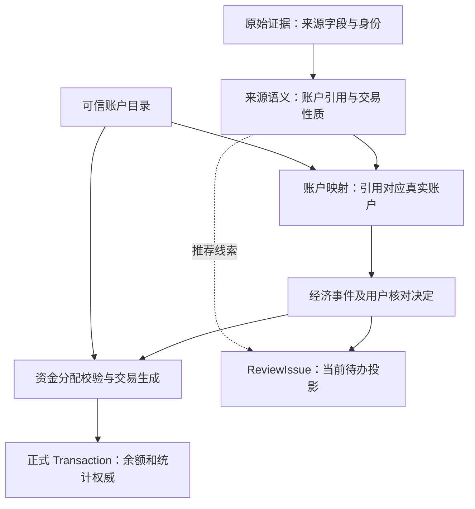

# 账户与资金分配架构审查

审查日期：2026-09-05。范围：账户归组、组合付款、合并还款、正式交易投影及维护。运行与部署证据以实施规划 21.18 为准。

## 1. 之前的重构解决了什么

MINI-1904C 的重构对象是正式交易服务分层：命令、查询、报表、纯领域校验、事务与一致性快照。它改善了工程依赖和读取一致性，**没有建立完整的多方资金分配模型**。`specs/mini-1904c-core-layering/design.md` 明确记录该范围。不可变分录内核仍属后续 A2/A3 规划，不能当成已完成。

统一导入版本 `095157d6` 已支持原始证据、EconomicEvent、ReviewIssue 和正式 Transaction 分离，支持单付款方归还多个负债账户。因此此前同时展示花呗和信用购、成功拆分还款是真实实现。

但同一版本的 `repayment-allocation.js` 已包含候选白名单：仅本批原始行中发现、且映射到账本的目标可以参加分配。此次不是把已支持的任意补选改坏，而是旧实现只覆盖了特定数据组合。后续组合付款又增加一套独立决定和投影分支，缺少两套决定之间的总体验证。过去把局部闭环称为整体完成是不准确的。

## 2. 问题和证据

| 问题 | 根因与代码证据 | 影响 | 本次处理 |
| --- | --- | --- | --- |
| 合并还款只显示一个目标 | `organizer-planner.accountReferences(validRows)` → `source-funds.withAggregateCandidates` 仅收集本批；`model.repaymentAllocationOptions` 原来只返回 candidateIds | 只还款、未消费的历史账户无法选 | 推荐和可选目录分离；补选或在核对中建草稿 |
| 服务端拒绝合法补选 | `repaymentAllocationsForEvent` 的 v1 白名单把候选当资格 | 单改前端仍保存失败 | v2 以可信账户目录验证资格；v1 已存决定继续兼容 |
| 组合支付被当成账户组 | 交易类型与账户引用混用，一个 subject 代表多个支付工具 | 第二步混入金额，已有卡无法复用组合记录 | 21.17 已按账户引用多对多关联同一事件；本次回归继续验证 |
| 两套分配数据按分支顺序投影 | `transactionDrafts` 原先先处理 paymentResolution 再处理 aggregate repayment | 两套字段混在同一事件时，投影可能只取一套 | `funds-allocation` 统一决定入口；冲突在保存、可入账判定及投影均阻断 |
| 测试未验证候选覆盖不足 | 原集成夹具同时有花呗消费、信用购消费和合并还款；“越界账户”失败用例还同时传错总额 | 测试通过无法证明不存在候选遗漏，也未隔离拒绝原因 | 增加零/一候选、历史目标、新建、合法金额下越权/类型拒绝等端到端用例 |

合并标题“花呗／信用购”不能证明用户有两个实际负债账户；本批只有一个候选，也不能证明本笔只还了该账户。来源覆盖不完整与真实账户数量必须分开表达。

## 3. 稳定的职责边界

| 对象 | 负责 | 不应负责 |
| --- | --- | --- |
| 原始证据 | 保存来源原文、位置、身份和可追溯版本 | 用整理结果覆盖原文 |
| 来源账户引用 | 说明付款工具、还款目标或聚合目标；稳定身份与模糊线索区分 | 把聚合名称创建为第三个真实账户 |
| 账本账户与映射 | 真实资产/负债身份；来源引用映射到真实账户 | 由本批有没有消费决定账户能否被还款 |
| 推荐 | 为核对提供有依据的候选；保留来源范围 | 限定合法账户集合、宣称覆盖全部负债 |
| 用户决定 | 明确身份、性质和真实金额，版本化审计 | 单次补选自动建立永久产品成员关系 |
| 资金分配 | 统一校验守恒、账户资格、决定一致性，生成全部正式交易 | 取第一个账户代表总金额；先匹配的决定覆盖另一个决定 |
| ReviewIssue | 根据缺失条件生成待办，同一事件可关联多个账户组 | 成为与事件并列的金额/账户事实来源 |
| Transaction | 正式余额、现金流和统计的唯一权威 | 使用账户问题数或候选数推算交易笔数 |

## 4. 本次已实现的工程收口

- `funds-allocation.js` 是分配决定的统一解释入口，适配现有 paymentResolution 和 repaymentAllocations；分配账户验证被整理保存、posting 以及已入账更正共同调用，正式多笔投影也由该模块生成。
- 账户资格依赖服务端按可信 uid 读取/锁定的账户元数据，检查同币种、未归档、负债类型和非付款账户。前端筛选只是交互辅助。
- v2 合并还款不限制在本批候选中；前端只将本批候选优先放进分配行，界面只显示原有账户名称，不展示内部推荐标记或添加“历史”前缀；其他已有负债通过“补充还款账户”选择，避免把全部信用账户铺开。
- 整理中补建负债只产生本批草稿；与决定同一事务、同一个 requestId 幂等边界；正式入账才物化。相同规范化名称、相同类型/币种的正式账户或本批草稿复用，类型冲突或归档时拒绝。
- 金额不根据候选数量自动填写；“全部”是用户主动操作，并清空其他行金额。删除行、新建名称、金额修改都会重新校验保存状态。
- 已保存的手工补选会在再次打开时恢复；账户已不可用则保留提示行，要求移除后重选，不静默丢掉原金额。
- v1 已保存决定保留原版本语义，重新确认写 v2；无 schema、读取重写、旧批次重解析或自动账本写入。

## 5. 必须明确的能力边界

| 场景 | 当前行为 |
| --- | --- |
| 单账户普通付款 | 原有单笔 Transaction |
| 多账户付款，形成一笔支出 | 已支持；各付款分项生成支出，合计等于原事件 |
| 多账户付款，归还一个明确负债账户 | 已支持；各付款分项生成到同一目标的转账 |
| 一个付款账户，归还多个负债账户 | 已支持；用户补齐金额，生成多笔转账 |
| 多个付款账户，同时归还多个负债账户 | 尚未实现完整人工路径编辑；冲突组合明确阻断。不得将两套边际金额交叉相乘、按顺序配对或悄悄采用其中一套 |
| 聚合产品的长期成员目录 | 未实现独立持久目录；当前候选仍来自来源证据。人工补选只影响该次决定，不推断全局成员关系 |
| 组合付款的分项退款与单笔更正 | 现有明确限制仍在，不能因投影共用就宣称已支持；整批撤销可用 |

没有为了解决此次候选遗漏而新增“合并账单账户”或虚构中转账户，也没有把正式 Transaction 迁移成另一套分录表。

## 6. 后续架构演进及验收门槛

1. 统一来源语义与账户引用生成。目前初次规划、1688 草稿兼容投影、前端性质建议仍有各自的推断入口；需将来源证据到语义/账户角色的纯规则收敛，兼容升级只调用投影器，不另造业务规则。
2. 如引入长期产品成员目录，必须保存可信 uid、来源、有效版本及用户确认依据；历史回填只能采用强证据，单次手选不能自动推广成永久成员关系。采用显式 forward-only 迁移。
3. 多对多分配须先确定完整实际资金路径契约。只有两侧各自合计，无法唯一恢复每一笔 from→to；编辑、守恒、来源证据、正式交易、退款、更正、撤销必须共同验收。
4. review-issue-service 与小程序页面仍承担较多命令和界面状态。下一次拆分应按账户映射、退款关系、分配核对命令拆，并共用纯领域策略及事务编排，不能只移动文件后宣称完成领域重构。

上述四项是待办，不属于本次已完成能力。

## 7. 回归矩阵

- 候选 0/1/多个；目标本批缺席但已存在；仅一个实际目标；本批多个目标；已保存手选恢复。
- 补建草稿、同名复用、错误金额不留草稿；其他用户、资产账户、异币种、归档、自转账拒绝；权限检查不依赖候选。
- 整数分守恒、正金额、不重复、上限 20、差一分失败；单候选不预填；“全部”与删除重新计算。
- 组合付款与合并还款各自有效但同时存在仍拒绝；改变性质不能把旧决定退化成额外支出。
- 组合事件多个账户组、先采后付目标、同组计数及旧草稿确认保持。
- requestId 重试不重复；失败版本不递增；第二笔正式交易失败整批回滚；完整交易集合更正及整批撤销继续通过。

代码入口：`source-funds.js`、`payment-account-groups.js`、`funds-allocation.js`、`repayment-allocation.js`、`account-draft.js`、`review-issue-service.js`、`finance-update-posting.js`、`finance-update-maintenance.js`，以及小程序 import-workbench 的 model/index。

测试入口：`funds-allocation.test.js`、`repayment-allocation.test.js`、`payment-resolution.test.js`、`payment-account-groups.test.js`、`integration.test.js`、`import-workbench-model.test.js`、`import-account-choice.test.js`。
