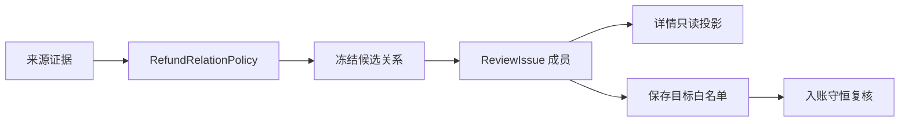

# 退款关系候选收口设计

## 领域边界

新增纯领域模块 `refund-relation-policy`，负责候选资格、证据分层、最高层选择和自动确认条件。规划器只负责把领域结果持久化为 `EconomicEventRelation`；问题详情只投影持久化关系；保存动作以当前 `ReviewIssue` 成员和 proposed 关系作事务内白名单，并复核目标性质、币种、顺序、金额与累计退款；入账继续执行金额守恒校验。

## 候选分层

1. `exact_reference`：同来源稳定交易号、订单号或商户订单号相同。
2. `explicit_refund_evidence`：原消费明确记录退款金额，且同来源、同商户、72 小时内和金额相符。
3. `item_evidence`：同来源、同账户、同币种、同金额、原消费在前且 72 小时内，去除“退款”“全款交易”等业务前缀后商品标题一致；允许平台聚合商户名与实际退款商户名不同。
4. `merchant_evidence`：同账户、同币种、原消费在前、180 天内、原金额足够且商户一致。

只保留当前非空的最高层。前两层唯一时可自动确认；商户与商品标题层即使唯一也只作人工建议。所有层都必须先通过共同资格校验。

## 列表交互

- `refund_relation` 不再生成顺序处理汇总入口，和其他不可共享决定一样逐项展示。
- 每行直接显示日期、退款摘要、来源、金额与“候选数/未找到”，点击该行只打开这一笔。
- 保存后统一重新加载 FinanceUpdate 并关闭面板，不自动打开下一笔；未处理项目仍留在原列表。
- 退款行共用现有主题令牌和列表节奏，不新增大标题、重底色或额外二级导航。

## 待关联退款生命周期

- `EconomicEvent.fieldSources.refundRelation` 保存 `{ version: 'refund-relation-state-v1', status: 'pending', confirmedBy: 'user' }`。它是导入草稿里的结构化事实，不依赖可被重新计算掉的提示文案。
- 仅当退款问题没有任何冻结候选时，服务端接受 `mark_refund_pending`；该动作移除阻塞原因、拒绝遗留 proposed 关系并令事件重新计算为 `ready`。
- 入账将其写为标准 `refund` 交易，`destination_account_id` 正常记入余额，`original_transaction_id` 保持 `NULL`。数据库原有可空外键足以表达该状态，无需新增交易类型或迁移表结构。
- 公共交易投影以 `original_transaction_id` 派生 `refundLinkStatus`：有原消费为 `linked`，无原消费为 `pending`；非退款为 `null`。
- 月汇总、分类、每日和趋势统计仅让 `original_transaction_id IS NOT NULL` 的退款冲减支出。待关联退款不作为收入，也不冲减某个未知分类的支出。
- 手工交易命令不改变：手工创建或编辑退款仍要求 `originalTransactionId`，避免把导入专用的证据不足出口扩散到普通记账。

## API 与安全

- `reviews.get` 不再返回额外 `refundChoices`，候选完全来自问题成员中的 `refund_of` 关系。
- `reviews.resolve(link_refund)` 必须锁定并验证该问题的 `candidate` 成员及其 `proposed` 关系，不允许临时创建集合外关系。
- `reviews.resolve(mark_refund_pending)` 只接受零候选的单笔退款问题，并在同一事务内保存待关联状态、解决问题和重算批次计数。
- 客户端只渲染服务端关系成员，并根据关系原因显示“订单匹配 / 退款凭据 / 同商户待核对 / 商品匹配待核对”。
- 不记录原始交易正文、账户标识或数据库绑定值。

## 测试策略

- 纯领域测试：强证据压制弱证据、商户和商品弱证据不得自动确认。
- 服务测试：详情不得扩大候选、集合外目标被拒绝。
- MySQL 集成测试：持久化问题成员、合法选择、非法选择与累计退款守恒。
- 静态契约测试：客户端不得引用 `refundChoices`，界面保留空状态和证据标签。
- 生命周期测试：待关联事件可入账、正式交易保留空原消费、余额增加而所有收支统计保持不变；手工退款规则不放宽。
