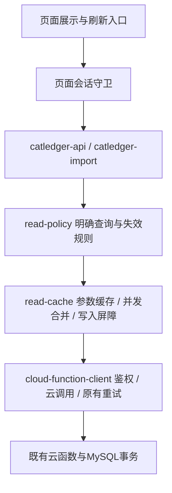

# 小程序请求与切页体验优化

任务：MINI-1906UI-REQUESTS。当前主会话负责，沿用用户要求的原开发者工具工作区和 `codex/mini-1906ui-all-pages` 分支。范围为客户端 services、App 会话清理、8个普通业务页面、对应回归及说明。导入草稿队列、公共API、服务端事务、MySQL及正式账本口径保持原契约。

## 目标与取舍

切页复用已有数据；真正需要读取时保留已显示内容。正式写入后不能继续使用旧余额和旧统计，旧会话结果不能写回新会话。减少请求和保证一致性同时验收，不用隐藏动画冒充性能优化。

旧实现按正常已初始化用户估算，四个主页面一轮约7次读取：首页1次，明细2次，账本2次，个人2次；分类尚未准备时明细还需初始化。新实现冷启动四页一轮3次读取：首页汇总、初始化分类、交易列表；首页响应中的完整账户集合可以直接复用。缓存有效且本机未写入时，后续四页一轮0次读取。网络故障重试不计入上述正常请求预算。

采用连续前台使用期间复用。通过本机写入失效、App从后台恢复统一失效及手动刷新控制重读，发现其他设备的更新；当前没有服务端推送，不声称跨设备即时同步。缓存只在内存中保存，最多48条；冷启动重新读取，不额外保存财务副本到磁盘。

## 架构与职责

- `cloud-function-client.js`：原有可信云函数调用、登录同意检查、错误分类和重试策略，不处理页面状态。
- `read-policy.js`：唯一查询白名单和领域失效映射，未知动作不自动缓存。
- `read-cache.js`：完整参数规范化键、结果副本、有效期、并发合并、写入屏障、会话代次及48条上限；不解释金额，不重放写动作。
- `catledger-api.js`：将查询策略与实际调用连接；显式刷新传第三参数 `{ force: true }`；`bootstrap` 走同一缓存入口。首页账户复用由服务端实际返回完整集合支持，不从前三个展示账户构造列表。
- `catledger-import.js`：不缓存导入查询／草稿决定；仅在正式 post/undo/correct 时失效普通账本查询，并阻止旧会话响应交付。
- `page-read-session.js`：页面登录会话变更时清除原账户／账目展示和在途句柄；旧回调不能恢复原内容或结束新请求的加载状态。
- 页面：保留各自显示模型、筛选和交互，只在真正缺少新鲜结果时显示原有加载状态；禁止自行推算或修改缓存余额。

## 查询与失效矩阵

| 查询 | 有效期 | 依赖领域 |
| --- | --- | --- |
| bootstrap、categories.list | 连续前台使用期间 | categories |
| accounts.list | 连续前台使用期间 | accounts |
| dashboard.get、transactions.list、transactions.refundable | 连续前台使用期间 | accounts、transactions、categories |
| statistics.get | 连续前台使用期间 | transactions、categories |

| 动作 | 失效领域 |
| --- | --- |
| accounts.create、correctBalance | accounts、transactions |
| accounts.createBatch、update、archive | accounts |
| categories.create、update、archive、restore、reorder | categories |
| categories.assignTransactions | transactions |
| transactions.create、update、delete、linkRefund | accounts、transactions |
| financeUpdates.post、undo、economicEvents.correct | accounts、transactions、categories |

新增正式写动作必须审查此矩阵。失效发生在发送前和完成后，失败也失效，因为网络失败可能无法判断服务端是否提交。读取等待相关写入结束；写入前启动的旧读取即使晚到，也必须按新代次重读，不能覆盖新结果。无关领域的缓存保留。

## 页面行为

1. 首次读取：没有缓存时按原页面显示加载；同一查询同时触发只发一次。
2. 普通返回：新鲜缓存不联网、不闪加载；明细保留后续分页和当前筛选。
3. 数据失效（写入或从后台恢复）：进入页面时重读，已有内容保持，失败显示原有错误提示，不把失败当作空账本。
4. 手动刷新：首页刷新按钮及已有下拉刷新入口绕过有效期；仍合并相同在途请求。
5. 切月份／日期／账户／分类／搜索及游标：完整参数分别缓存；账户和分类按ID恢复选择，不以旧数组下标错选新对象。
6. 明细初次进入：分类、账户与交易并行准备；账户筛选失效后按新筛选重读。分页读取期间若发生写入或首屏基线失效，重新读取首屏，不拼接新旧数据。
7. 普通记账：只准备账户与分类；选择退款或编辑／关联已有退款时才读取可退款支出。退款候选加载失败可重试，未准备完成不能保存退款；切回普通收支不受该加载影响。
8. 导入工作台：继续由 `import-draft-session` 管理草稿与版本，不加入通用TTL缓存。确认页本地明细仍为零请求。
9. 退出登录：清空缓存并更新会话代次；包括非缓存动作在内的旧响应不再交付。再次登录的页面等待期间清除旧内容。

## 验证与发布

- `test/read-cache.test.js`：并发合并、完整参数键、副本隔离、TTL、主动刷新、失败重试、写入屏障、旧响应、退出隔离和容量。
- `test/cached-page-requests.test.js`：实际 Page + 客户端调用链，四页冷启动3请求／回访0请求、无加载闪烁、分页保留、正式写入失效、退款按需读取、新会话清屏和分页写入竞态。
- 原有客户端完整回归、云调用重试策略、页面声明事件和静态检查保持通过。
- 原开发者工具只读切页计数：已加载首页后首次四页新增 bootstrap 与 transactions.list 共2次；第二轮0次，四页加载成功且无错误。
- 原生补验：手动刷新首页1请求，普通记账0请求，切换退款1请求；表单成功，无错误。完整客户端246/246及481文件／94模块静态检查通过。
- 代码质量复扫受CUA noWindowsAvailable阻断，未取得本轮新扫描结果。真机待用户验收，不代替真实写入；不以测试替用户执行真实入账。

回滚：仅回滚客户端缓存、页面接线和会话守卫，恢复原请求频率；无数据迁移或已入账数据回滚。发布为开发版，不执行Git提交／合并／推送或正式发布。

## 0.4.34：按使用过程复用与统计图表

用户要求已入账数据不因几分钟经过而重复读取，现行策略改为Infinity；缓存仍有容量边界，不落盘。App从后台恢复统一失效一次，由可见页面按需读取；当前未引入服务端版本查询或推送，持续前台使用无法主动发现其他设备写入，可手动刷新。App生命周期不改变登录代次，旧写入屏障继续有效。

统计展示独立模型为pages/statistics/model.js：使用同一statistics.get快照生成月收支、累计结余、收支同卡分类构成及支出日历。金额精确累加复用提取后的utils/minor-arithmetic.js，坐标才转Number；分类图只计算正净额占比，并保留负退款明细。无额外图表请求，点击本地选值；选月读取其缓存键。空月入口只定位近六月内最近有收支月，任意月份通过日期选择器进入。

验证：250项客户端回归通过；新增statistics-charts.test.js覆盖精度、负退款、空数据、分类合并及后台恢复；原模拟器实际绘图与交互通过，0新增请求回访。代码质量新扫描受窗口控制错误阻断，真机待验收。

0.4.37展示覆盖：顶部左右箭头切换月份，点击日期直接选月，不显示日期旁下拉小箭头。删除近期月份入口和四项指标卡，收支构成置于收支总额之后；半年趋势点击详情在卡片内固定区域更新。仅展示层变化，查询缓存与统计口径不变。
